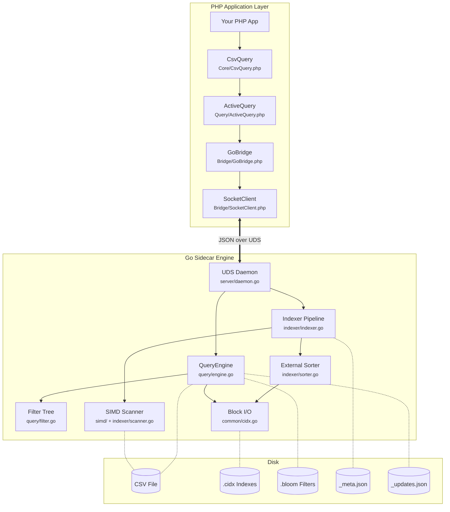
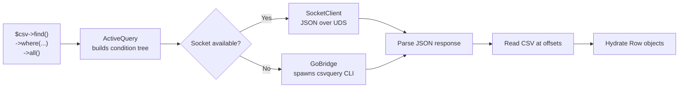
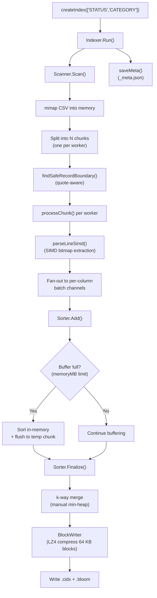
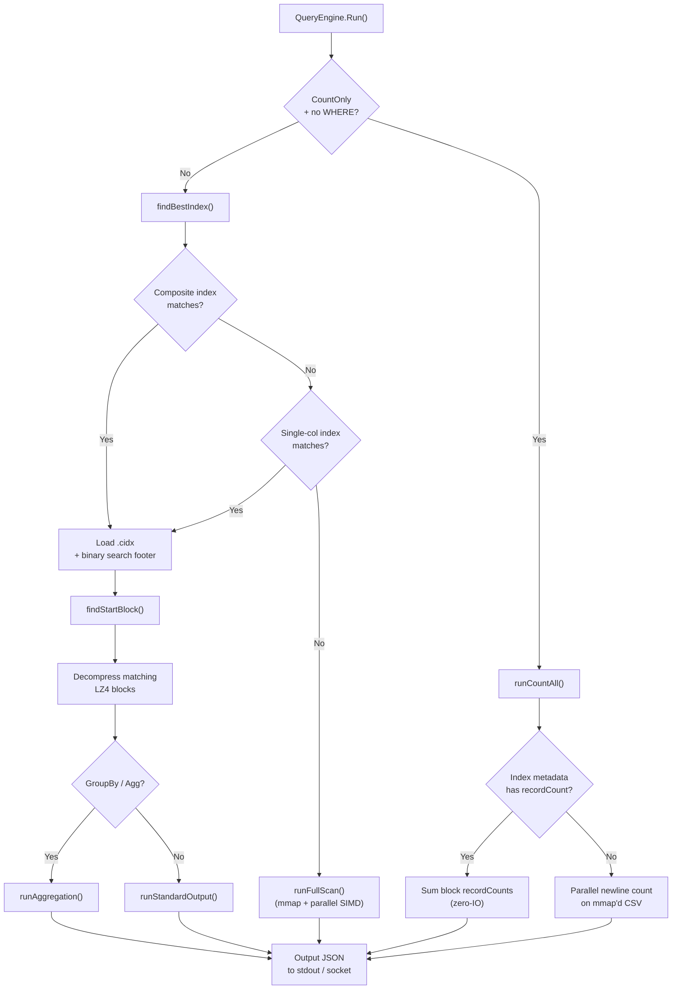
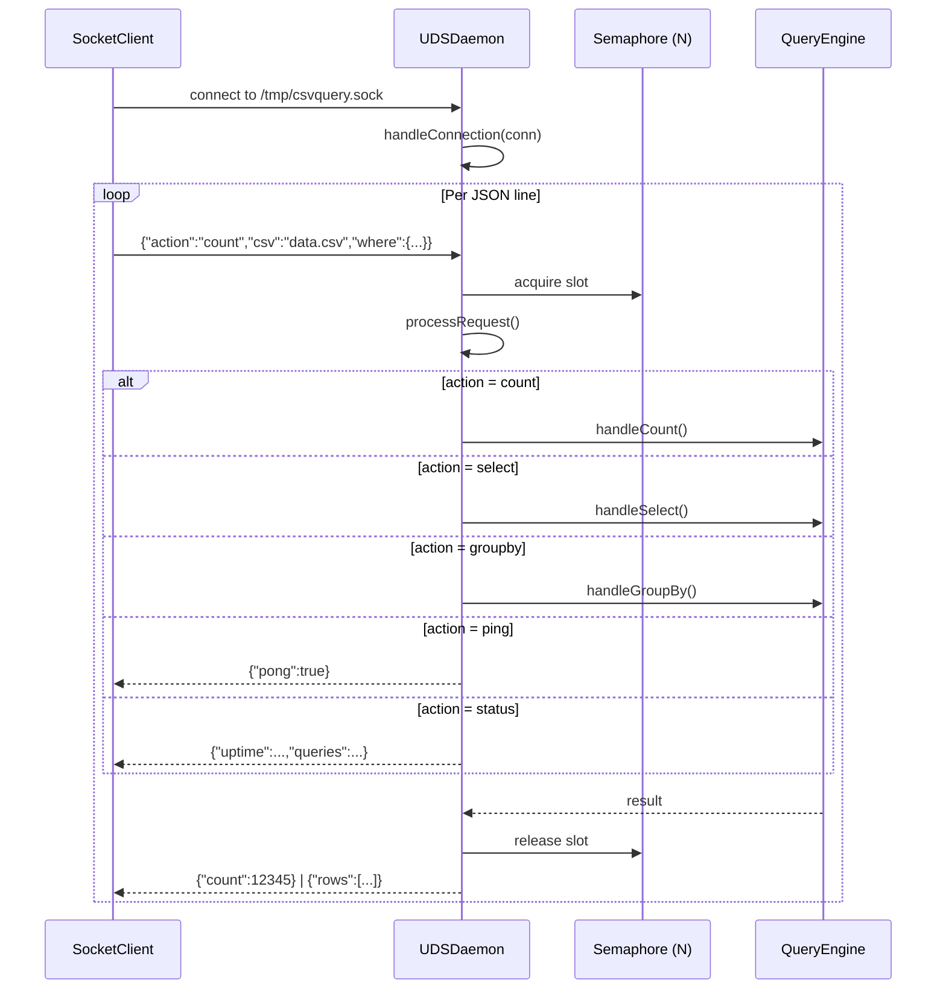
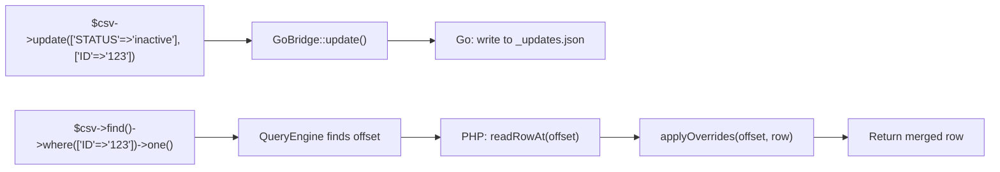

# CsvQuery Architecture

> Deep-dive into the internals of CsvQuery — a PHP + Go sidecar engine that turns CSV files into indexed, queryable data stores.

---

## Overview

CsvQuery is a **hybrid PHP / Go system**. PHP provides the developer-facing API (Yii2-style fluent query builder), while a long-lived Go daemon handles all CPU-intensive work — indexing, scanning, filtering, and aggregation — communicating over **Unix Domain Sockets (UDS)**.



---

## PHP Layer

### Module Map

```
src/php/
├── Core/
│   └── CsvQuery.php          # Entry point, index lifecycle, row reads, mutations
├── Query/
│   ├── ActiveQuery.php        # Fluent query builder (where/orderBy/limit/groupBy/…)
│   └── Command.php            # SQL-like debug representation
├── Bridge/
│   ├── GoBridge.php           # Go binary wrapper (spawn + socket modes)
│   ├── SocketClient.php       # UDS singleton client, auto-starts daemon
│   └── DaemonManager.php      # Daemon process lifecycle
└── Models/
    ├── Row.php                # ArrayAccess / JsonSerializable result row
    ├── Cell.php               # Type-safe value wrapper with validation
    └── Column.php             # Column metadata view
```

### Module Responsibilities

| Module | Key Class | Responsibility |
|--------|-----------|----------------|
| **Core** | `CsvQuery` | Entry point. Manages CSV path, headers, index creation / deletion, integrity validation, row reads at byte offsets, insert / update / addColumn |
| **Query** | `ActiveQuery` | Fluent builder. Chains `where`, `andWhere`, `orWhere`, `filterWhere`, `select`, `orderBy`, `groupBy`, `limit`, `offset`, `indexBy`, `asArray`. Executes via `all()`, `one()`, `count()`, `sum()`, `average()`, `min()`, `max()`, `each()`, `explain()` |
| **Query** | `Command` | Generates SQL-like string from query state for debugging |
| **Bridge** | `GoBridge` | Detects platform binary, supports two execution modes: **socket** (default — fast, persistent) and **CLI spawn** (fallback). Handles index creation, queries, counts, writes, updates, alter, version |
| **Bridge** | `SocketClient` | Singleton UDS client. Auto-starts the Go daemon if the socket file is missing. Sends JSON requests (`count`, `select`, `groupby`, `ping`, `status`) and parses JSON responses |
| **Models** | `Row` / `Cell` / `Column` | Lightweight wrappers providing `ArrayAccess`, magic property access, type-safe casts (`asInt`, `asFloat`, `asBool`), inline validation |

### Request Flow (PHP side)



---

## Go Layer

### Package Map

```
src/go/
├── main.go                    # CLI dispatcher (index, query, daemon, write, version)
└── internal/
    ├── common/                # Shared types and I/O primitives
    │   ├── common.go          #   IndexRecord (80 B), IndexMeta, ReadRecord, WriteRecord
    │   ├── cidx.go            #   BlockWriter / BlockReader (LZ4 compressed blocks)
    │   ├── bloom.go           #   Bloom filter implementation
    │   ├── mmap_unix.go       #   mmap for Linux / macOS
    │   └── mmap_windows.go    #   mmap for Windows
    ├── indexer/               # Index build pipeline
    │   ├── indexer.go         #   Orchestrator: parse columns → scan → sort → write
    │   ├── scanner.go         #   Parallel mmap + SIMD CSV scanner
    │   └── sorter.go          #   External merge sort (k-way, manual min-heap)
    ├── query/                 # Query execution
    │   ├── engine.go          #   QueryEngine: findBestIndex, IndexScan, FullScan, aggregation
    │   └── filter.go          #   Condition tree (AND/OR/Eq/Gt/Lt/Like/In/…)
    ├── server/                # Daemon
    │   ├── daemon.go          #   UDSDaemon: listen, route JSON actions, concurrency limiter
    │   └── server.go          #   Server helpers
    ├── simd/                  # Hardware-accelerated scanning
    │   ├── simd_amd64.go      #   AVX2 / SSE4.2 implementation
    │   ├── simd_generic.go    #   Pure Go fallback for ARM64 / other
    │   └── stubs.go           #   Function pointer dispatch
    ├── alter/                 # Schema changes
    │   └── alter.go           #   Add column (virtual or materialized)
    ├── update/                # Row mutation
    │   └── command.go         #   Update command (sidecar writes)
    ├── updatemgr/             # Sidecar update file manager
    │   └── manager.go         #   Load / apply _updates.json overlays
    ├── writer/                # CSV append
    │   ├── writer.go          #   Append rows to CSV
    │   ├── lock_unix.go       #   flock() for Unix
    │   └── lock_windows.go    #   LockFileEx for Windows
    └── schema/                # Virtual columns
        └── manager.go         #   Schema file management
```

---

## Core Data Structures

### IndexRecord (80 bytes, zero-alloc)

Every index entry is a fixed-width binary record stored on disk:

```
┌──────────────────────────────────────┬──────────┬──────────┐
│           Key (64 bytes)             │ Offset   │ Line     │
│   null-padded column value           │  int64   │  int64   │
│                                      │ (8 bytes)│ (8 bytes)│
└──────────────────────────────────────┴──────────┴──────────┘
                          Total = 80 bytes
```

- **Key** — Column value (or composite key), fixed at 64 bytes for zero-allocation comparisons
- **Offset** — Byte position in the CSV file where the row begins
- **Line** — 1-based line number

### .cidx File Format (Compressed Index)

```
┌──────────────────────────────────────────────────────┐
│ Magic Header: "CIDX" (4 bytes)                       │
├──────────────────────────────────────────────────────┤
│ Block 0 — LZ4 compressed IndexRecords (64 KB target) │
├──────────────────────────────────────────────────────┤
│ Block 1 — LZ4 compressed IndexRecords                │
├──────────────────────────────────────────────────────┤
│ ...                                                  │
├──────────────────────────────────────────────────────┤
│ Block N — LZ4 compressed IndexRecords                │
├──────────────────────────────────────────────────────┤
│ Footer  — JSON SparseIndex (block metadata array)    │
├──────────────────────────────────────────────────────┤
│ Footer Length — int64 (8 bytes)                       │
└──────────────────────────────────────────────────────┘
```

Each block's metadata (`BlockMeta`) in the footer contains:

| Field | Type | Purpose |
|-------|------|---------|
| `startKey` | string | First key in the block (for binary search) |
| `offset` | int64 | Byte offset of the compressed block in the file |
| `length` | int64 | Compressed block size |
| `recordCount` | int64 | Number of records (enables zero-IO `COUNT(*)`) |
| `isDistinct` | bool | True if all keys in the block are identical |

### _meta.json (Index Metadata)

```json
{
  "capturedAt": "2026-02-07T12:00:00Z",
  "totalRows": 1000000,
  "csvSize": 67108864,
  "csvMtime": 1738886400,
  "csvHash": "a3f5c7d9e1...",
  "indexes": {
    "STATUS": { "distinctCount": 3, "fileSize": 4521984 },
    "CATEGORY": { "distinctCount": 4, "fileSize": 3876352 }
  }
}
```

Used by `validateIntegrity()` to detect stale indexes (changed CSV size, mtime, or sample hash).

---

## Indexing Pipeline



### Key Optimizations

| Optimization | Where | Impact |
|--------------|-------|--------|
| **mmap** | `Scanner` | Zero-copy file reads, OS page cache handles eviction |
| **SIMD bitmaps** | `parseLineSimd()` | AVX2/SSE4.2 scan for delimiters & quotes at 64-byte stride |
| **Parallel workers** | `Scanner.Scan()` | N goroutines process N chunks concurrently |
| **External merge sort** | `Sorter` | Index files larger than RAM; flushed chunks are k-way merged |
| **Manual min-heap** | `kWayMerge()` | Avoids `container/heap` interface boxing allocations |
| **Bloom filter** | `Sorter` | Built concurrently during sort; used at query time for early rejection |
| **Batched I/O** | `WriteBatchRecords` | Single `write()` syscall per record batch |
| **LZ4 compression** | `BlockWriter` | 10× faster decompression than Gzip; 64 KB block target |

---

## Query Execution



### Index Selection Strategy

`findBestIndex()` evaluates candidates in priority order:

1. **Composite index** — if all equality columns from `WHERE` match a composite `.cidx`
2. **Single-column index** — if a single equality column matches
3. **GroupBy index** — if the `GROUP BY` column has its own index
4. **Full scan** — fallback when no index covers the query

### Filter Tree

Conditions are parsed from JSON into a **binary tree** of `Condition` nodes:

```
                    AND
                   /   \
              Eq(STATUS, 'active')   OR
                                    /  \
                          Gt(SCORE, 90)  Eq(TYPE, 'vip')
```

Each node implements `Evaluate(row map[string]string) bool`. Targets are pre-resolved to strings after parsing for allocation-free comparisons at evaluation time.

**Supported operators:** `=`, `!=`, `>`, `<`, `>=`, `<=`, `LIKE`, `IN`, `IS NULL`, `IS NOT NULL`

---

## Daemon Architecture



### Configuration

| Parameter | Default | Description |
|-----------|---------|-------------|
| `--socket` | `/tmp/csvquery.sock` | Unix socket path |
| `--host` / `--port` | `127.0.0.1:0` | TCP mode (when port > 0) |
| `--workers` | `50` | Max concurrent request handlers |
| `--csv` | — | Default CSV path |
| `--index-dir` | — | Default index directory |

The daemon uses a **semaphore** (buffered channel of size `MaxConcurrency`) to limit parallelism. Each connection is handled in a dedicated goroutine, reading newline-delimited JSON requests in a loop.

---

## Sidecar Update System

CsvQuery treats CSV files as **immutable on disk**. Mutations (`insert`, `update`, `addColumn`) are stored in a sidecar `_updates.json` file and applied as overlays during reads.



This design avoids costly CSV file rewrites while keeping all query paths consistent.

---

## Cross-Platform Strategy

| Concern | Approach |
|---------|----------|
| **Binary detection** | `GoBridge::detectBinary()` maps `PHP_OS_FAMILY` + `php_uname('m')` to `csvquery_{os}_{arch}` |
| **SIMD** | `simd_amd64.go` for AVX2/SSE4.2; `simd_generic.go` pure-Go fallback for ARM64 |
| **File locking** | `lock_unix.go` (`flock`) / `lock_windows.go` (`LockFileEx`) |
| **mmap** | `mmap_unix.go` / `mmap_windows.go` |
| **Build** | `CGO_ENABLED=0` — fully static binaries, no C toolchain required |

---

## Key Design Decisions

| Decision | Rationale |
|----------|-----------|
| **PHP ↔ Go sidecar** | Offloads indexing and scanning to Go (10–100× faster than PHP for CPU-bound work), while keeping the developer API in PHP's ecosystem |
| **UDS over HTTP** | ~1 ms round-trip vs ~200 ms for process spawn; no TCP overhead for local-only communication |
| **Fixed 80-byte records** | Zero-allocation reads/writes; enables direct `binary.Read` with no reflection |
| **LZ4 over Gzip** | 10× faster decompression at a small compression-ratio trade-off |
| **External merge sort** | Handles datasets larger than available RAM; memory budget per worker is configurable |
| **Generator streaming** | `each()` returns a PHP `Generator`; only one row is materialized at a time |
| **Sidecar updates** | Avoids expensive CSV rewrites; overlays are applied at read time |
| **Bloom filters** | Reject entire index blocks before decompressing; reduces I/O for sparse matches |
| **Modular namespaces** | Clean separation: `Core` / `Query` / `Bridge` / `Models` in PHP; `internal/*` in Go |

---

## Import Paths

### PHP

```php
use Entreya\CsvQuery\Core\CsvQuery;
use Entreya\CsvQuery\Query\ActiveQuery;
use Entreya\CsvQuery\Query\Command;
use Entreya\CsvQuery\Bridge\GoBridge;
use Entreya\CsvQuery\Bridge\SocketClient;
use Entreya\CsvQuery\Models\Row;
use Entreya\CsvQuery\Models\Cell;
use Entreya\CsvQuery\Models\Column;
```

### Go

```go
import (
    "github.com/entreya/csvquery/internal/common"
    "github.com/entreya/csvquery/internal/indexer"
    "github.com/entreya/csvquery/internal/query"
    "github.com/entreya/csvquery/internal/server"
    "github.com/entreya/csvquery/internal/simd"
    "github.com/entreya/csvquery/internal/writer"
)
```
