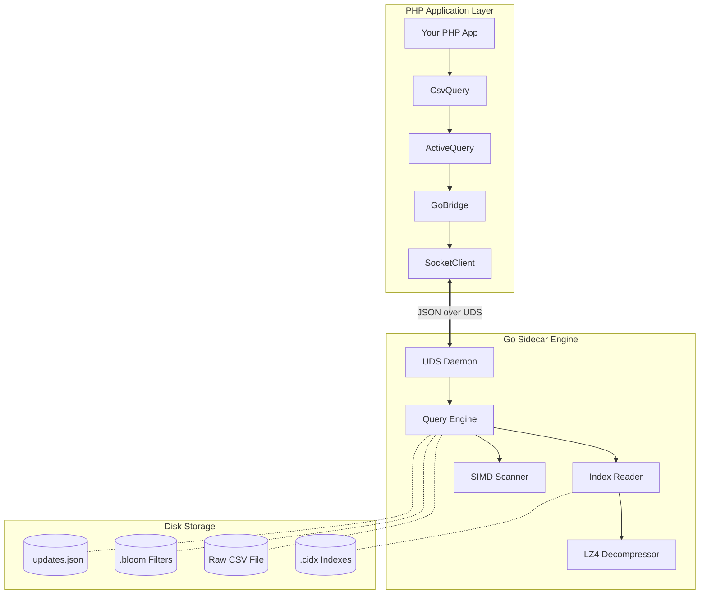
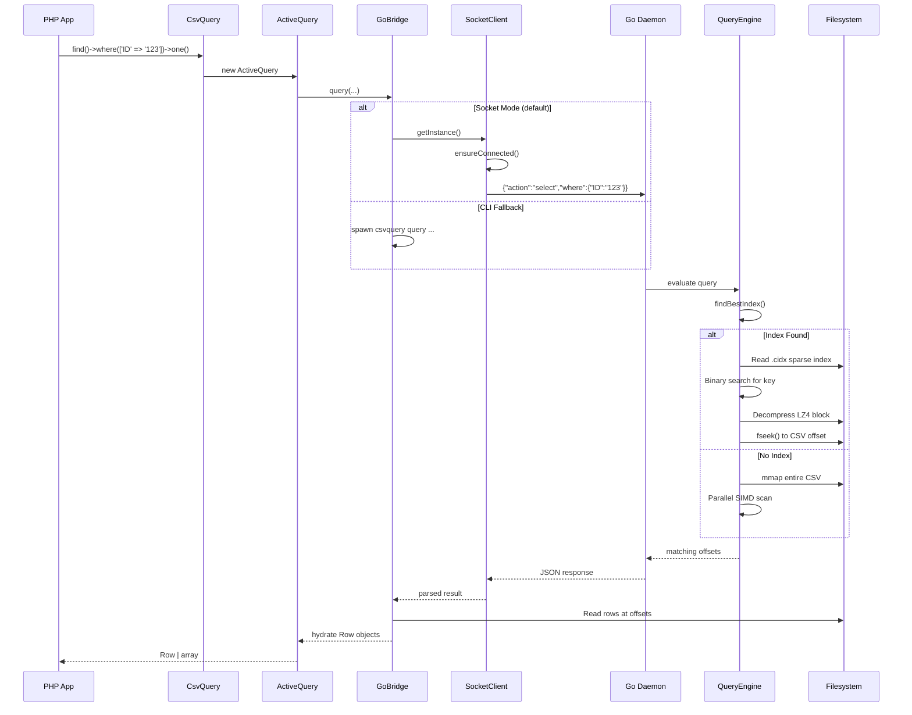
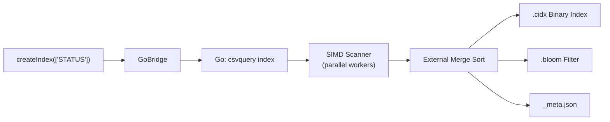
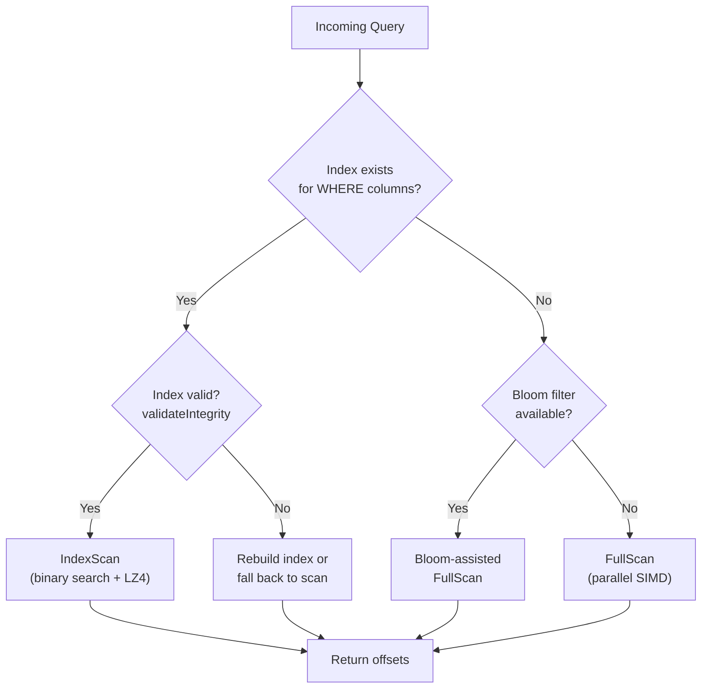
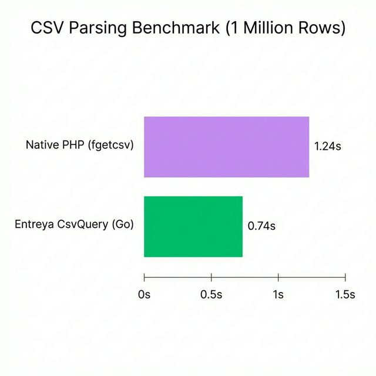

<p align="center">
  <h1 align="center">CsvQuery</h1>
  <p align="center">
    <strong>Query massive CSV files like a database — powered by a Go sidecar engine.</strong>
  </p>
</p>

<p align="center">
  <a href="https://github.com/entreya/csvquery/actions"></a>
  <a href="https://github.com/entreya/csvquery/releases"></a>
  <a href="LICENSE"></a>
  
  
</p>

<br>

**CsvQuery** is a high-performance query engine that turns CSV files (10 GB–1 TB+) into searchable, indexed data stores. A fluent PHP API (inspired by Yii2 ActiveQuery) communicates with a Go sidecar daemon over Unix Domain Sockets, delivering **sub-millisecond query latency** without the overhead of a traditional database.

> 📚 **Full documentation →** [entreya.github.io/csvquery-docs](https://entreya.github.io/csvquery-docs/)

---

## Table of Contents

- [Key Features](#-key-features)
- [Architecture](#-architecture)
- [Installation](#-installation)
- [Quick Start](#-quick-start)
- [Usage Examples](#-usage-examples)
- [API Reference](#-api-reference)
- [Data Flow](#-data-flow)
- [Performance](#-performance)
- [CLI Reference](#-cli-reference)
- [Project Structure](#-project-structure)
- [Testing](#-testing)
- [Contributing](#-contributing)
- [License & Acknowledgments](#-license--acknowledgments)

---

## ✨ Key Features

| Feature | Description |
|---------|-------------|
| 🚀 **SIMD-Accelerated Parsing** | AVX2 / SSE4.2 instructions scan CSV delimiters at hardware speed (10 GB/s+) |
| 📊 **Massive Scale** | Benchmarked on 18 M+ rows, 10 GB+ files |
| 💾 **Memory Efficient** | `mmap`-based file access with LZ4-compressed indexes |
| 🔍 **Yii2-like Fluent API** | Familiar `find()→where()→all()` query builder for PHP developers |
| ⚡ **Zero-IO Index Scans** | `COUNT(*)` operations resolve from index metadata alone — the CSV is never opened |
| 🔄 **Live Updates** | Sidecar `_updates.json` system makes immutable CSVs mutable |
| 🔌 **Daemon Mode** | Persistent Go process over UDS for ~1 ms latency (vs ~200 ms per-process spawn) |
| 🌐 **Cross-Platform** | Pre-compiled binaries for Linux, macOS, and Windows (AMD64 & ARM64) |

---

## 🏗️ Architecture

CsvQuery uses a **PHP + Go Sidecar** design.  Your PHP application talks to a long-lived Go daemon through **Unix Domain Sockets (UDS)**, keeping query latency under a millisecond.



### Key Technologies

| Component | Technology | Why |
|-----------|-----------|-----|
| **Parsing** | AVX2 / SSE4.2 SIMD | Scan delimiters at hardware speed |
| **Compression** | LZ4 block codec | 10× faster decompression than Gzip |
| **File Access** | `mmap` | Zero-copy reads, OS-managed page cache |
| **IPC** | Unix Domain Sockets | ~1 ms round-trip vs ~200 ms process spawn |
| **Probabilistic Filter** | Bloom filters | Reject non-matching index blocks before decompression |

### Design Patterns

| Pattern | Where | Purpose |
|---------|-------|---------|
| **Sidecar Process** | Go daemon | Offload CPU-intensive work from PHP |
| **Fluent Builder** | `ActiveQuery` | Chainable, composable query construction |
| **Singleton** | `SocketClient` | Reuse a single daemon connection per request |
| **Generator / Streaming** | `each()`, `GoBridge::query()` | Process millions of rows without loading them all into memory |
| **External Merge Sort** | Indexer | Build indexes on files larger than available RAM |

---

## 📦 Installation

### Prerequisites

| Requirement | Version |
|-------------|---------|
| PHP | 8.1+ |
| Composer | 2.x |
| Go *(optional — pre-compiled binaries included)* | 1.21+ |

### Via Composer

```bash
composer require entreya/csvquery
```

The Go binary is **compiled automatically** on `composer install`. If Go is not available on your machine, the bundled pre-compiled binary for your platform will be used instead.

### Build Commands

```bash
composer build          # Build for current platform
composer build:all      # Cross-compile for all platforms
composer build:clean    # Remove all compiled binaries
```

### Manual Build

```bash
php scripts/build.php           # Current OS/arch
php scripts/build.php --all     # All platforms
```

### Platform Notes

| Platform | Notes |
|----------|-------|
| **macOS** | ARM64 (Apple Silicon) and AMD64 binaries included |
| **Linux** | AMD64 and ARM64 binaries included |
| **Windows** | Statically linked `.exe` — no MinGW / Cygwin / WSL required |

> See [CONTRIBUTING.md](CONTRIBUTING.md) for per-platform development setup.

---

## 🚀 Quick Start

```php
<?php
require 'vendor/autoload.php';

use Entreya\CsvQuery\Core\CsvQuery;

// 1. Point to your CSV
$csv = new CsvQuery('/data/sales.csv', [
    'indexDir' => '/data/indexes',   // optional — defaults to CSV directory
    'workers'  => 8,                 // optional — parallel indexing workers
]);

// 2. Create indexes (one-time, ~400 k rows/sec)
$csv->createIndex(['STATUS', 'CATEGORY']);

// 3. Query with a fluent API
$results = $csv->find()
    ->select(['ID', 'NAME', 'STATUS'])
    ->where(['STATUS' => 'active'])
    ->andWhere(['>', 'SCORE', 80])
    ->orderBy(['SCORE' => SORT_DESC])
    ->limit(100)
    ->all();

// 4. Stream large result sets with generators
foreach ($csv->find()->where(['CATEGORY' => 'premium'])->each() as $row) {
    echo $row['NAME'] . "\n";
}

// 5. Aggregations
$count = $csv->find()->where(['STATUS' => 'active'])->count();
$total = $csv->find()->groupBy('CATEGORY')->sum('AMOUNT');
```

---

## 📖 Usage Examples

### Filtering with Operators

```php
// Comparison operators
$csv->find()->where(['>', 'PRICE', 100])->all();
$csv->find()->where(['<=', 'AGE', 30])->all();
$csv->find()->where(['!=', 'STATUS', 'deleted'])->all();

// BETWEEN
$csv->find()->where(['BETWEEN', 'AGE', 18, 65])->all();

// IN
$csv->find()->where(['IN', 'CATEGORY', ['A', 'B', 'C']])->all();

// LIKE
$csv->find()->where(['LIKE', 'NAME', '%john%'])->all();
```

### Complex Nested Conditions

```php
$csv->find()
    ->where(['OR',
        ['STATUS' => 'active'],
        ['AND',
            ['>', 'SCORE', 90],
            ['TYPE' => 'vip']
        ]
    ])
    ->all();
```

### Aggregations & Group By

```php
// Simple aggregations
$avg   = $csv->find()->where(['STATUS' => 'active'])->average('SCORE');
$min   = $csv->find()->min('PRICE');
$max   = $csv->find()->max('PRICE');
$sum   = $csv->find()->sum('AMOUNT');
$count = $csv->find()->count();

// Group-by counts
$stats = $csv->find()->groupBy('CATEGORY')->count();
// → ['A' => 1200, 'B' => 890, 'C' => 450]
```

### Data Mutation

```php
// Insert a single row
$csv->insert(['ID' => '999', 'NAME' => 'Alice', 'STATUS' => 'active']);

// Batch insert
$csv->batchInsert([
    ['ID' => '1000', 'NAME' => 'Bob',   'STATUS' => 'active'],
    ['ID' => '1001', 'NAME' => 'Carol', 'STATUS' => 'pending'],
]);

// Update rows (sidecar — does not rewrite CSV)
$csv->update(
    ['STATUS' => 'inactive'],         // SET
    ['ID' => '123']                   // WHERE
);

// Add a virtual column
$csv->addColumn('REGION', 'UNKNOWN');
```

### Query Debugging

```php
// Inspect the generated SQL-like representation
$command = $csv->find()
    ->select(['ID', 'NAME'])
    ->where(['STATUS' => 'active'])
    ->orderBy(['NAME' => SORT_ASC])
    ->limit(10)
    ->createCommand();

echo $command->getQuery();
// → SELECT ID, NAME FROM `sales` WHERE `STATUS` = 'active' ORDER BY NAME ASC LIMIT 10

// Explain the execution plan
$plan = $csv->find()->where(['STATUS' => 'active'])->explain();
// → ['strategy' => 'IndexScan', 'index' => 'STATUS', ...]
```

### Efficient Iteration

```php
// each() returns a Generator — only one row is in memory at a time
foreach ($csv->find()->where(['STATUS' => 'active'])->each() as $row) {
    // $row is a Row object with ArrayAccess
    echo $row['NAME'];

    // Or use model methods
    $cell = $row->getCell('SCORE');
    echo $cell->asInt();          // type-safe cast
    echo $cell->isNumeric();      // true/false
}

// Index results by a column
$byId = $csv->find()
    ->indexBy('ID')
    ->all();
// → ['42' => Row, '43' => Row, ...]

// Return plain arrays instead of Row objects
$arrays = $csv->find()->asArray()->all();
```

---

## 📋 API Reference

### `CsvQuery` — Entry Point

```php
use Entreya\CsvQuery\Core\CsvQuery;

$csv = new CsvQuery(string $csvPath, array $options = []);
```

#### Constructor Options

| Option | Type | Default | Description |
|--------|------|---------|-------------|
| `indexDir` | `string` | CSV directory | Directory to store `.cidx` / `.bloom` files |
| `separator` | `string` | `,` | CSV column delimiter |
| `workers` | `int` | CPU count | Parallel workers for indexing |
| `memoryMB` | `int` | `500` | Memory limit per worker (MB) |
| `binaryPath` | `string` | Auto-detect | Custom path to the Go binary |

#### Methods

| Method | Returns | Description |
|--------|---------|-------------|
| `find()` | `ActiveQuery` | Start a new query |
| `where($condition, $value)` | `ActiveQuery` | Shorthand for `find()->where(...)` |
| `andWhere($condition, $value)` | `ActiveQuery` | Shorthand for `find()->andWhere(...)` |
| `createIndex(array $columns, bool $verbose, array $options)` | `bool` | Create indexes (single or composite) |
| `hasIndex(string\|array $column)` | `bool` | Check whether an index exists |
| `dropIndex(string\|array $column)` | `bool` | Remove a specific index |
| `clearIndexes()` | `int` | Remove **all** indexes; returns count deleted |
| `getHeaders()` | `array` | Column names from the CSV header row |
| `insert(array $row)` | `void` | Append a single row |
| `batchInsert(array $rows)` | `void` | Append multiple rows |
| `update(array $attributes, array $conditions)` | `int` | Update matching rows via sidecar; returns count |
| `addColumn(string $name, string $default)` | `void` | Add a virtual column |
| `getMeta()` | `array` | Index metadata (row count, file hash, etc.) |
| `validateIntegrity()` | `bool` | Check if indexes are still valid for the current CSV |

---

### `ActiveQuery` — Query Builder

```php
$query = $csv->find();
```

#### Condition Methods *(return `$this` for chaining)*

| Method | Description |
|--------|-------------|
| `where($condition, $value = null)` | Set the WHERE clause |
| `andWhere($condition, $value = null)` | Append an AND condition |
| `orWhere($condition, $value = null)` | Append an OR condition |
| `filterWhere(array $condition)` | WHERE, ignoring empty/null values |
| `andFilterWhere(array $condition)` | AND, ignoring empty/null values |
| `orFilterWhere(array $condition)` | OR, ignoring empty/null values |

#### Modifier Methods *(return `$this` for chaining)*

| Method | Description |
|--------|-------------|
| `select(array $columns)` | Choose which columns to return |
| `orderBy(array\|string $columns)` | Set ORDER BY |
| `addOrderBy(array\|string $columns)` | Append additional ORDER BY |
| `groupBy(array\|string $columns)` | Set GROUP BY |
| `addGroupBy(array\|string $columns)` | Append additional GROUP BY |
| `limit(int $n)` | Maximum rows to return |
| `offset(int $n)` | Skip first *n* rows |
| `indexBy(string\|callable $column)` | Key results by a column value |
| `asArray(bool $flag = true)` | Return plain arrays instead of `Row` objects |
| `debug(bool $enable = true)` | Enable debug mode on the bridge |

#### Execution Methods

| Method | Returns | Description |
|--------|---------|-------------|
| `all()` | `array` | All matching rows |
| `one()` | `?Row` | First matching row |
| `count(string $q = '*')` | `int` | Count of matching rows |
| `sum(string $column)` | `float` | Sum of column values |
| `average(string $column)` | `float` | Average of column values |
| `min(string $column)` | `mixed` | Minimum column value |
| `max(string $column)` | `mixed` | Maximum column value |
| `each()` | `Generator` | Stream rows one at a time |
| `aggregate(string $col, array $fns)` | `array` | Multiple aggregations in one pass |
| `explain()` | `array` | Query execution plan |
| `createCommand()` | `Command` | SQL-like debug representation |

#### Condition Syntax

```php
// Hash format (implicit AND)
->where(['STATUS' => 'active', 'TYPE' => 'premium'])

// Operator format
->where(['>', 'SCORE', 80])
->where(['BETWEEN', 'AGE', 18, 65])
->where(['IN', 'CATEGORY', ['A', 'B', 'C']])
->where(['LIKE', 'NAME', '%john%'])

// Nested logical groups
->where(['OR',
    ['STATUS' => 'active'],
    ['AND',
        ['>', 'SCORE', 90],
        ['TYPE' => 'vip']
    ]
])
```

---

### `Row` — Result Object

Implements `ArrayAccess`, `IteratorAggregate`, and `JsonSerializable`.

```php
$row = $csv->find()->one();

// Array access
echo $row['NAME'];

// Magic property
echo $row->NAME;

// Model methods
$row->getColumn('NAME');         // → Column object
$row->getCell('NAME');           // → Cell object
$row->toAssociativeArray();      // → ['NAME' => 'Alice', ...]
$row->getLineNumber();           // → int|null
$row->toJson();                  // → JSON string
```

### `Cell` — Value Wrapper

```php
$cell = $row->getCell('SCORE');

$cell->getValue();               // raw value
$cell->asInt();                  // (int) cast with default
$cell->asFloat();                // (float) cast with default
$cell->asBool();                 // 1/true/yes/on/y → true
$cell->asString();               // (string) cast
$cell->isEmpty();                // null or ''
$cell->isNumeric();              // is_numeric()

// Inline validation
$result = $cell->validate(['required', 'numeric', 'min:1', 'max:100']);
// → ['valid' => true, 'errors' => []]
```

### `Column` — Column View

```php
$col = $row->getColumn('NAME');

$col->getValue();
$col->getName();                 // 'NAME'
$col->getIndex();                // column position (0-based)
$col->getCell();                 // → Cell
$col->trim();
$col->toUpper();
$col->toLower();
```

---

## 🔄 Data Flow

### Query Lifecycle



### Index Creation



### Query Strategy Decision



---

## ⚡ Performance



Benchmarks on **1,000,000 rows** (Darwin ARM64, Apple M-series):

### Indexing Throughput

| Task | Throughput | Wall Time |
|------|-----------|-----------|
| Single-column index | ~400,000 rows/sec | ~2.5 s |
| Composite index (2 cols) | ~350,000 rows/sec | ~2.9 s |

### Query Latency

| Query Type | Matching Rows | Latency |
|------------|--------------|---------|
| `COUNT(*)` — no filter | all | ~10 ms |
| `COUNT` — indexed filter (0 hits) | 0 | ~14 ms |
| `COUNT` — indexed filter | 150 K | ~25 ms |
| `SELECT` — indexed filter | 1 K | ~50 ms |
| Full table scan (no index) | all | ~2,000 ms |

> [!TIP]
> **Zero-IO Index Scans** — If the query can be satisfied entirely by index metadata (e.g. `COUNT(*)`), the engine never opens the CSV file.

---

## 🛠️ CLI Reference

The Go binary can be invoked directly for maintenance, debugging, or scripting:

```bash
./bin/csvquery <command> [flags]
```

### Commands

<details>
<summary><strong><code>index</code></strong> — Create indexes from a CSV file</summary>

```bash
./bin/csvquery index \
  --input  data.csv \
  --columns '["STATUS", "CATEGORY"]' \
  --output  /path/to/indexes \
  --workers 8 \
  --memory  500 \
  --bloom   0.01 \
  --verbose
```

| Flag | Default | Description |
|------|---------|-------------|
| `--input` | *(required)* | Path to CSV file |
| `--output` | CSV directory | Output directory for index files |
| `--columns` | `[]` | JSON array of columns to index |
| `--separator` | `,` | CSV delimiter |
| `--workers` | CPU count | Parallel workers |
| `--memory` | `500` | Memory limit per worker (MB) |
| `--bloom` | `0.01` | Bloom filter false-positive rate |
| `--verbose` | `false` | Print progress |

</details>

<details>
<summary><strong><code>query</code></strong> — Execute queries</summary>

```bash
./bin/csvquery query \
  --csv       data.csv \
  --index-dir /path/to/indexes \
  --where     '{"STATUS":"active"}' \
  --limit     100 \
  --count
```

| Flag | Default | Description |
|------|---------|-------------|
| `--csv` | | Path to CSV file |
| `--index-dir` | CSV directory | Index directory |
| `--where` | `{}` | JSON conditions |
| `--limit` | `0` (unlimited) | Max results |
| `--offset` | `0` | Skip first *n* results |
| `--count` | `false` | Output only the count |
| `--explain` | `false` | Print query execution plan |
| `--group-by` | | Column to group by |
| `--agg-col` | | Column to aggregate |
| `--agg-func` | | Aggregation function |

</details>

<details>
<summary><strong><code>daemon</code></strong> — Start the UDS server</summary>

```bash
./bin/csvquery daemon \
  --socket    /tmp/csvquery.sock \
  --index-dir /path/to/indexes \
  --workers   50
```

| Flag | Default | Description |
|------|---------|-------------|
| `--socket` | `/tmp/csvquery.sock` | Unix socket path |
| `--host` | `127.0.0.1` | TCP host (if `--port` is set) |
| `--port` | `0` | TCP port (0 = use Unix socket) |
| `--csv` | | Default CSV path |
| `--index-dir` | | Default index directory |
| `--workers` | `50` | Max concurrent handlers |

</details>

<details>
<summary><strong><code>write</code></strong> — Append rows to a CSV file</summary>

```bash
./bin/csvquery write \
  --csv  data.csv \
  --data '[["1001","Alice","active"]]' \
  --headers '["ID","NAME","STATUS"]'
```

| Flag | Default | Description |
|------|---------|-------------|
| `--csv` | *(required)* | Target CSV file |
| `--headers` | `[]` | JSON array of headers (new file only) |
| `--data` | `[]` | JSON array of row arrays |
| `--separator` | `,` | CSV delimiter |

</details>

<details>
<summary><strong><code>version</code></strong> — Print version</summary>

```bash
./bin/csvquery version
# → CsvQuery v1.0.0 (2026-02-07)
```

</details>

---

## 📂 Project Structure

```
csvquery/
├── src/
│   ├── php/                        # PHP source (Entreya\CsvQuery\)
│   │   ├── Core/
│   │   │   └── CsvQuery.php        # Entry point, index lifecycle
│   │   ├── Query/
│   │   │   ├── ActiveQuery.php      # Fluent query builder
│   │   │   └── Command.php          # SQL-like debug output
│   │   ├── Bridge/
│   │   │   ├── GoBridge.php         # Go binary wrapper
│   │   │   └── SocketClient.php     # UDS daemon client (singleton)
│   │   └── Models/
│   │       ├── Row.php              # Row with ArrayAccess
│   │       ├── Cell.php             # Type-safe cell wrapper
│   │       └── Column.php           # Column metadata view
│   └── go/                          # Go source
│       ├── main.go                  # CLI entry point
│       ├── go.mod
│       └── internal/
│           ├── common/              # Shared types (IndexRecord, Meta)
│           ├── indexer/             # CSV indexing pipeline
│           ├── query/               # Query engine, index selection
│           ├── server/              # Unix socket daemon
│           ├── simd/                # AVX2/SSE4.2 scanning
│           ├── alter/               # Schema modifications
│           ├── update/              # Row update operations
│           ├── updatemgr/           # Update file management
│           ├── writer/              # CSV write operations
│           └── schema/              # Virtual columns
├── bin/                             # Pre-compiled Go binaries
├── benchmarks/                      # Performance benchmarks
├── examples/
│   └── quick_start.php
├── tests/                           # PHPUnit tests
├── scripts/
│   └── build.php                    # Cross-platform build script
├── ARCHITECTURE.md
├── CHANGELOG.md
├── CONTRIBUTING.md
├── composer.json
├── LICENSE
└── README.md
```

> See [ARCHITECTURE.md](ARCHITECTURE.md) for detailed module documentation.

---

## 🧪 Testing

### PHP

```bash
composer install
composer test                           # or: ./vendor/bin/phpunit tests/
```

### Go

```bash
cd src/go
go test -v ./internal/...
go test -bench=. -benchmem ./internal/query/
```

---

## 🤝 Contributing

Contributions are welcome! Please see [CONTRIBUTING.md](CONTRIBUTING.md) for guidelines.

```bash
# 1. Fork & clone
git clone https://github.com/<you>/csvquery.git && cd csvquery

# 2. Create a feature branch
git checkout -b feature/amazing-feature

# 3. Make changes, run tests
composer test

# 4. Commit (conventional commits encouraged)
git commit -m 'feat: add amazing feature'

# 5. Push & open a Pull Request
git push origin feature/amazing-feature
```

---

## 📜 License & Acknowledgments

This project is licensed under the **MIT License** — see the [LICENSE](LICENSE) file for details.

**Acknowledgments:**

- Query API inspired by [Yii2 ActiveQuery](https://www.yiiframework.com/doc/api/2.0/yii-db-activequery)
- LZ4 compression via [pierrec/lz4](https://github.com/pierrec/lz4)
- SIMD optimizations inspired by [simdjson](https://github.com/simdjson/simdjson)
