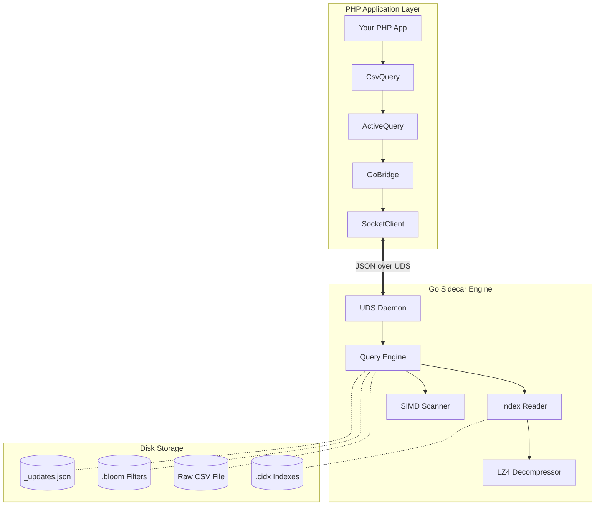
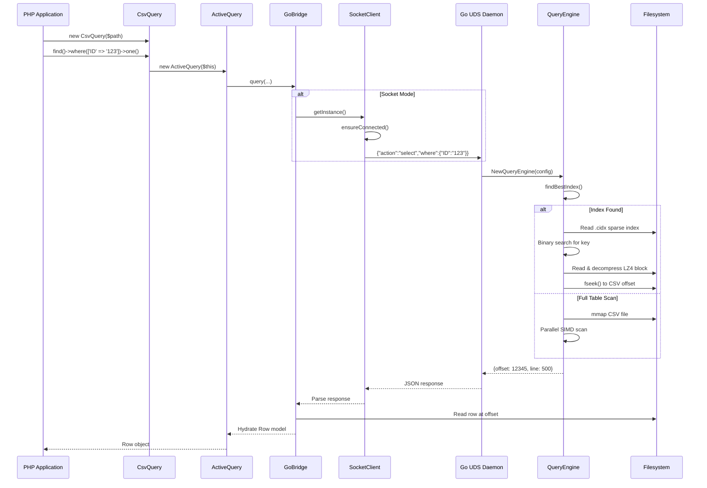

# CsvQuery


**CsvQuery** is a high-performance query engine that treats massive CSV files (10GB - 1TB+) like searchable databases. It uses a **PHP + Go Sidecar Architecture** to achieve sub-millisecond query latencies without the overhead of traditional database systems.

## ✨ Key Features

- 🚀 **Blazing Fast**: SIMD-accelerated CSV parsing (AVX2/SSE4.2) at 10GB/s+
- 📊 **Massive Scale**: Tested on 18M+ rows, 10GB+ files
- 💾 **Memory Efficient**: Mmap-based access with LZ4-compressed indexes
- 🔍 **Yii2-like API**: Familiar fluent query builder for PHP developers
- ⚡ **Zero-IO Queries**: COUNT operations bypass CSV reads entirely via index metadata
- 🔄 **Live Updates**: Sidecar update system for mutable data in immutable CSVs

---

## 🏗️ Architecture

CsvQuery operates as a sidecar. Your PHP application communicates with a high-performance Go daemon via **Unix Domain Sockets (UDS)**.



### Key Technologies

| Component | Technology | Purpose |
|-----------|-----------|---------|
| **Parsing** | AVX2/SSE4.2 SIMD | Scan CSV delimiters at hardware speed |
| **Compression** | LZ4 | 10x faster decompression than Gzip |
| **Storage** | mmap | Zero-copy file access |
| **Communication** | Unix Domain Sockets | ~1ms latency vs ~200ms for process spawning |

---

## 📦 Installation

### Requirements

| Platform | Requirements |
|----------|-------------|
| **All** | PHP 8.1+, Go 1.21+ |
| **Linux/macOS** | Unix Domain Socket support (recommended) |
| **Windows** | None (Binary is statically linked) |

### Via Composer

```bash
composer require entreya/csvquery
```

The Go binary is built automatically on install. If Go is not available, pre-compiled binaries for your platform are included.

### Build Commands

```bash
# Build for current platform
composer build

# Build for all platforms
composer build:all

# Clean all binaries
composer build:clean
```

### Manual Build

```bash
php scripts/build.php           # Build for current OS/arch
php scripts/build.php --all     # Build all platforms
```

### Windows Notes

The Windows binary is statically linked and does not require MinGW, Cygwin, or WSL to run. Just use the `.exe` as is.

> See [CONTRIBUTING.md](CONTRIBUTING.md) for detailed platform-specific setup.

---

## 🚀 Quick Start

```php
<?php
require 'vendor/autoload.php';

use Entreya\CsvQuery\Core\CsvQuery;

// 1. Initialize with your CSV file
$csv = new CsvQuery('/path/to/data.csv', [
    'indexDir' => '/path/to/indexes',  // Optional: defaults to CSV directory
    'workers' => 8,                     // Optional: parallel workers for indexing
]);

// 2. Create indexes for fast searching (one-time operation)
$csv->createIndex(['STATUS', 'CATEGORY']);

// 3. Query with fluent API
$results = $csv->find()
    ->select(['ID', 'NAME', 'STATUS'])
    ->where(['STATUS' => 'active'])
    ->andWhere(['>', 'SCORE', 80])
    ->orderBy(['SCORE' => SORT_DESC])
    ->limit(100)
    ->all();

// 4. Iterate efficiently with generators
foreach ($csv->find()->where(['CATEGORY' => 'premium'])->each() as $row) {
    echo $row['NAME'] . "\n";
}

// 5. Aggregations
$count = $csv->find()->where(['STATUS' => 'active'])->count();
$total = $csv->find()->groupBy('CATEGORY')->sum('AMOUNT');
```

---

## 📖 API Reference

### CsvQuery (Entry Point)

```php
$csv = new CsvQuery(string $csvPath, array $options = []);
```

**Options:**
| Option | Type | Default | Description |
|--------|------|---------|-------------|
| `indexDir` | string | CSV directory | Where to store index files |
| `separator` | string | `,` | CSV column separator |
| `workers` | int | CPU count | Parallel workers for indexing |
| `memoryMB` | int | 500 | Memory limit per worker (MB) |
| `binaryPath` | string | Auto-detect | Custom path to Go binary |

**Methods:**
- `find(): ActiveQuery` - Start a new query
- `where($condition, $value = null): ActiveQuery` - Start query with WHERE
- `createIndex(array $columns, bool $verbose = false): bool` - Create indexes
- `hasIndex(string|array $column): bool` - Check if index exists
- `dropIndex(string|array $column): bool` - Remove an index
- `clearIndexes(): int` - Remove all indexes
- `getHeaders(): array` - Get column names
- `insert(array $row): void` - Insert a single row
- `batchInsert(array $rows): void` - Insert multiple rows
- `update(array $attributes, array $conditions = []): int` - Update rows
- `addColumn(string $name, string $default = ''): void` - Add new column

### ActiveQuery (Query Builder)

```php
$query = $csv->find();
```

**Condition Methods:**
- `where($condition, $value = null): self` - Set WHERE clause
- `andWhere($condition, $value = null): self` - Add AND condition
- `orWhere($condition, $value = null): self` - Add OR condition
- `filterWhere(array $condition): self` - WHERE ignoring empty values

**Modifier Methods:**
- `select(array $columns): self` - Select specific columns
- `orderBy(array|string $columns): self` - Set ORDER BY
- `groupBy(array|string $columns): self` - Set GROUP BY
- `limit(int $limit): self` - Set LIMIT
- `offset(int $offset): self` - Set OFFSET
- `indexBy(string|callable $column): self` - Index results by column
- `asArray(bool $value = true): self` - Return arrays instead of Row objects

**Execution Methods:**
- `all(): array` - Get all matching rows
- `one(): ?Row` - Get first matching row
- `count(): int` - Count matching rows
- `sum(string $column): float` - Sum column values
- `average(string $column): float` - Average column values
- `min(string $column): mixed` - Minimum value
- `max(string $column): mixed` - Maximum value
- `each(): Generator` - Iterate with generator
- `explain(): array` - Get query execution plan

### Condition Syntax

CsvQuery supports Yii2-style conditions:

```php
// Hash format (implicit AND)
->where(['STATUS' => 'active', 'TYPE' => 'premium'])

// Operator format
->where(['>', 'SCORE', 80])
->where(['BETWEEN', 'AGE', 18, 65])
->where(['IN', 'CATEGORY', ['A', 'B', 'C']])
->where(['LIKE', 'NAME', '%john%'])

// Nested conditions
->where(['OR',
    ['STATUS' => 'active'],
    ['AND',
        ['>', 'SCORE', 90],
        ['TYPE' => 'vip']
    ]
])
```

---

## 🔄 Query Lifecycle



---

## ⚡ Performance


Benchmarks on **1,000,000 rows** (Darwin arm64):

### Indexing Performance

| Task | Throughput | Time |
|------|------------|------|
| Full File Indexing | ~400,000 rows/sec | 50 seconds |
| Composite Index (2 cols) | ~350,000 rows/sec | 55 seconds |

### Query Latency

| Query Type | Hits | Latency |
|------------|------|---------|
| COUNT(*) no filter | N/A | ~10ms |
| COUNT with indexed filter | 0 | ~14ms |
| COUNT with indexed filter | 150K | ~25ms |
| SELECT with filter | 1K rows | ~50ms |
| Full table scan | N/A | ~2000ms |

> [!TIP]
> **Zero-IO Index Scans**: If your query (e.g., `COUNT(*)`) can be satisfied entirely by index metadata, the engine skips reading the CSV file altogether.

---

## 🛠️ CLI Reference

The `csvquery` binary can be used directly for maintenance and debugging:

```bash
# Create indexes
./bin/csvquery index --input data.csv --columns '["STATUS", "CATEGORY"]' --verbose

# Query from command line
./bin/csvquery query --csv data.csv --where '{"STATUS":"active"}' --count

# Start daemon server
./bin/csvquery daemon --socket /tmp/csvquery.sock

# Show version
./bin/csvquery version
```

| Command | Description |
|---------|-------------|
| `index` | Create indexes from CSV |
| `query` | Execute queries against CSV |
| `daemon` | Start Unix Domain Socket server |
| `write` | Append data to CSV |
| `version` | Show version information |

---

## 📂 Project Structure

```
csvquery/
├── src/
│   ├── php/                # PHP source files (namespace: Entreya\CsvQuery\)
│   │   ├── Core/           # Entry point, CSV handling
│   │   │   └── CsvQuery.php
│   │   ├── Query/          # Query building
│   │   │   ├── ActiveQuery.php
│   │   │   └── Command.php
│   │   ├── Bridge/         # Go binary communication
│   │   │   ├── GoBridge.php
│   │   │   └── SocketClient.php
│   │   └── Models/         # Data wrappers
│   │       ├── Row.php
│   │       ├── Cell.php
│   │       └── Column.php
│   └── go/                 # Go source files
│       ├── main.go
│       ├── go.mod
│       └── internal/       # Internal packages
├── bin/                    # Pre-compiled Go binaries
├── tests/                  # PHP & Go tests
├── ARCHITECTURE.md         # Detailed architecture docs
├── composer.json
├── LICENSE
└── README.md
```

> See [ARCHITECTURE.md](ARCHITECTURE.md) for detailed module documentation.

---

## 🧪 Testing

### PHP Tests

```bash
composer install
./vendor/bin/phpunit tests/
```

### Go Tests

```bash
cd src/go
go test -v ./internal/...
go test -bench=. -benchmem ./internal/query/
```

---

## 🤝 Contributing

Contributions are welcome! Please see [CONTRIBUTING.md](CONTRIBUTING.md) for guidelines.

1. Fork the repository
2. Create a feature branch (`git checkout -b feature/amazing-feature`)
3. Commit your changes (`git commit -m 'Add amazing feature'`)
4. Push to the branch (`git push origin feature/amazing-feature`)
5. Open a Pull Request

---

## 📜 License

This project is licensed under the MIT License - see the [LICENSE](LICENSE) file for details.

---

## 🙏 Acknowledgments

- Inspired by [Yii2 ActiveQuery](https://www.yiiframework.com/doc/api/2.0/yii-db-activequery)
- LZ4 compression via [pierrec/lz4](https://github.com/pierrec/lz4)
- SIMD optimizations inspired by [simdjson](https://github.com/simdjson/simdjson)
