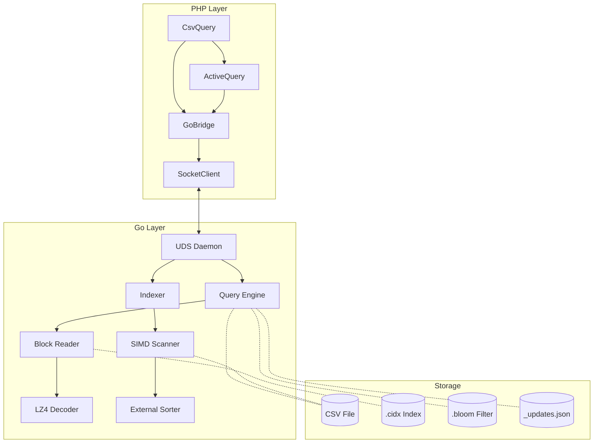

# CsvQuery Architecture

This document provides a deep technical dive into CsvQuery's hybrid PHP + Go architecture.

## Overview

CsvQuery is designed around a **sidecar architecture** where:

- **PHP** provides the user-facing API (fluent query builder)
- **Go** handles all compute-intensive operations (indexing, scanning, querying)

This separation allows PHP applications to leverage Go's raw performance without FFI complexity.

---

## System Components



---

## PHP Components

### CsvQuery (Entry Point)

The main class that users interact with. Responsibilities:

- CSV file validation and header parsing
- Index directory management
- Factory for `ActiveQuery` instances
- Delegates heavy operations to `GoBridge`

### ActiveQuery (Query Builder)

Implements a fluent interface similar to Yii2's `ActiveQuery`:

- `where()`, `andWhere()`, `orWhere()` - Condition building
- `select()`, `orderBy()`, `groupBy()` - Query modification
- `limit()`, `offset()` - Pagination
- `all()`, `one()`, `count()` - Execution

Internally builds a JSON query object sent to Go.

### GoBridge (Process Manager)

Handles all communication with the Go binary:

- **Binary Detection**: Auto-selects correct binary for OS/arch
- **Mode Selection**: 
  - Primary: Unix Domain Socket (persistent connection)
  - Fallback: CLI process spawning
- **Result Hydration**: Converts Go responses to PHP objects

### SocketClient (Connection Manager)

Manages the UDS connection:

- Connection pooling (singleton pattern)
- Auto-start of daemon if not running
- Retry logic with exponential backoff
- JSON streaming for large results

---

## Go Components

### main.go (CLI Entry Point)

Parses command-line flags and routes to appropriate subsystem:

- `index` → Indexer
- `query` → Query Engine
- `daemon` → UDS Server
- `write` → CSV Writer

### internal/indexer

#### indexer.go

Creates indexes from CSV files. Key features:

- **Multi-column Support**: Single and composite indexes
- **Incremental**: Detects existing indexes via meta file
- **Parallel**: Worker pool for concurrent processing

#### scanner.go

High-performance CSV scanning:

- **mmap**: Memory-mapped file access
- **SIMD**: AVX2/SSE4.2 for delimiter detection
- **Streaming**: Minimal memory footprint

#### sorter.go

External merge sort for unlimited scale:

- **Chunked Processing**: Sorts in-memory chunks
- **Disk Spillover**: Writes sorted chunks to temp files
- **K-Way Merge**: Merges sorted chunks efficiently
- **Deduplication**: Combines duplicate keys

### internal/query

#### engine.go

Query execution engine:

1. **Plan Selection**: Scores available indexes
2. **Bloom Check**: Early rejection for missing keys
3. **Index Scan**: Binary search on sparse index
4. **Block Read**: Decompress and filter records
5. **Row Fetch**: Seek to CSV offset and read

#### filter.go

Condition tree evaluation:

- Recursive evaluation of AND/OR trees
- Operator support: `=`, `!=`, `>`, `<`, `>=`, `<=`, `LIKE`, `IN`, `IS NULL`

### internal/common

Shared types used across packages:

- **BlockReader/BlockWriter**: LZ4 block I/O
- **BloomFilter**: Probabilistic set membership
- **IndexRecord**: Fixed-size index entry

### internal/server

#### daemon.go

Unix Domain Socket server:

- Listens on `/tmp/csvquery_<csv_hash>.sock`
- JSON-RPC style commands
- Graceful shutdown on SIGTERM

---

## Index Structure

### .cidx File Format

```
+----------------+
|  Magic "CIDX"  | 4 bytes
+----------------+
|  Block 1       | Variable (LZ4 compressed)
+----------------+
|  Block 2       |
+----------------+
|  ...           |
+----------------+
|  Block N       |
+----------------+
|  Footer (JSON) | Variable
+----------------+
|  Footer Length | 8 bytes
+----------------+
```

### Block Content

Each block contains sorted `IndexRecord` entries:

```go
type IndexRecord struct {
    Key    [64]byte  // Column value (padded)
    Offset int64     // Byte offset in CSV
    Line   int64     // Line number
}
```

### Sparse Index (Footer)

```json
{
  "blocks": [
    {
      "startKey": "active",
      "offset": 4,
      "length": 16384,
      "recordCount": 512,
      "isDistinct": false
    },
    ...
  ]
}
```

---

## Query Execution Flow

### 1. Query Building (PHP)

```php
$csv->find()
    ->where(['STATUS' => 'active'])
    ->andWhere(['>', 'SCORE', 80])
    ->limit(100)
    ->all();
```

### 2. JSON Serialization

```json
{
  "csv": "/path/to/data.csv",
  "indexDir": "/path/to/indexes",
  "where": {
    "operator": "AND",
    "children": [
      {"operator": "=", "column": "STATUS", "value": "active"},
      {"operator": ">", "column": "SCORE", "value": "80"}
    ]
  },
  "limit": 100
}
```

### 3. Index Selection (Go)

Engine scores available indexes:

```
Score = (columns_matched / total_columns) * selectivity_factor
```

### 4. Bloom Filter Check

If bloom filter exists for the key column:

```go
if !bloom.MightContain(key) {
    return []  // 100% certain: no matches
}
```

### 5. Sparse Index Binary Search

Find candidate blocks containing the key:

```go
for _, block := range footer.Blocks {
    if block.StartKey >= key {
        // This block might contain the key
        candidateBlocks = append(candidateBlocks, block)
    }
}
```

### 6. Block Decompression & Scan

```go
records := lz4.Decompress(block.Data)
for _, rec := range records {
    if rec.Key == key {
        matches = append(matches, rec.Offset)
    }
}
```

### 7. CSV Row Fetch

```go
for _, offset := range matches {
    file.Seek(offset, io.SeekStart)
    line := reader.ReadLine()
    results = append(results, parseLine(line))
}
```

---

## Performance Optimizations

### 1. SIMD Scanning

The `internal/simd` package uses AVX2/SSE4.2 instructions to find newlines and delimiters 16-32 bytes at a time.

### 2. LZ4 Compression

LZ4 was chosen over Gzip for:

- ~10x faster decompression
- Acceptable compression ratio (~50%)
- Low CPU overhead

### 3. Memory-Mapped I/O

Large CSV files are memory-mapped for:

- Lazy loading (OS handles paging)
- Zero-copy access
- Shared memory across processes

### 4. Connection Pooling

The UDS connection is reused across queries, avoiding:

- Connection establishment overhead (~100ms)
- Process spawning overhead (~200ms)

### 5. Zero-IO Index Scans

For queries like `COUNT(*)` with indexed filters, the engine can answer from index metadata alone without touching the CSV file.

---

## Memory Management

### PHP Side

- Generators (`each()`) for streaming large result sets
- Lazy header parsing
- Connection reuse via singleton

### Go Side

- `sync.Pool` for buffer reuse
- Streaming JSON responses
- mmap cleanup on query completion
- Graceful memory limits per worker

---

## Future Improvements

1. **Parallel Query Execution**: Fan out to multiple blocks concurrently
2. **Result Caching**: LRU cache for hot queries
3. **Partial Indexes**: Index only frequently queried value ranges
4. **TCP Socket Mode**: Windows support without UDS
5. **HTTP Server Mode**: REST API for multi-language access
