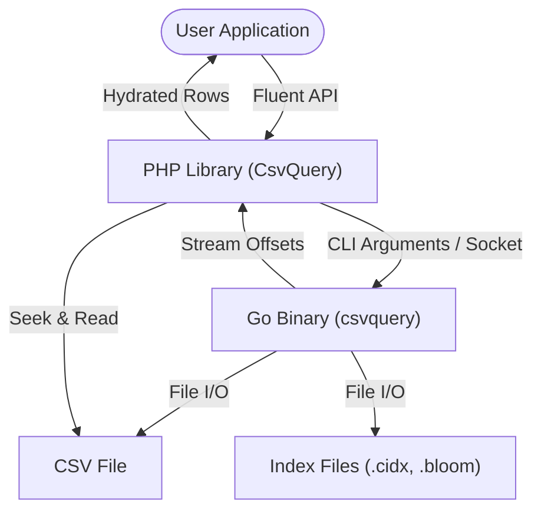
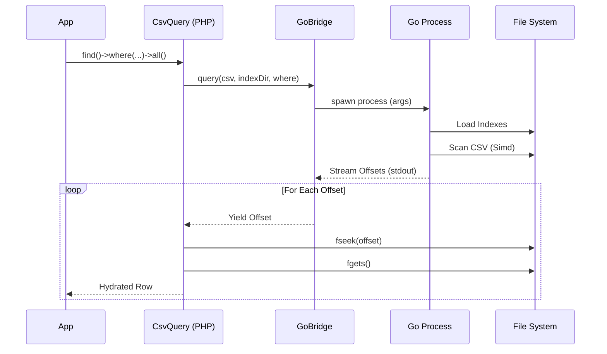

# Architecture Overview

## High-Level System Architecture

`csvquery` operates as a hybrid system leveraging PHP for the developer API and Go for performance-critical operations.

## Communication Flow

### Query Execution
1. **PHP**: Builds a query using `ActiveQuery`.
2. **PHP**: Invokes `GoBridge` to execute the Go binary.
3. **Go**: Parses arguments, loads indexes, and scans for matches.
4. **Go**: Streams matching **file offsets** (byte positions) back to PHP.
   - *Optimization*: Only offsets are transferred, not full rows.
5. **PHP**: Receives offsets, seeks the file pointer to the specific location, and reads the row.

