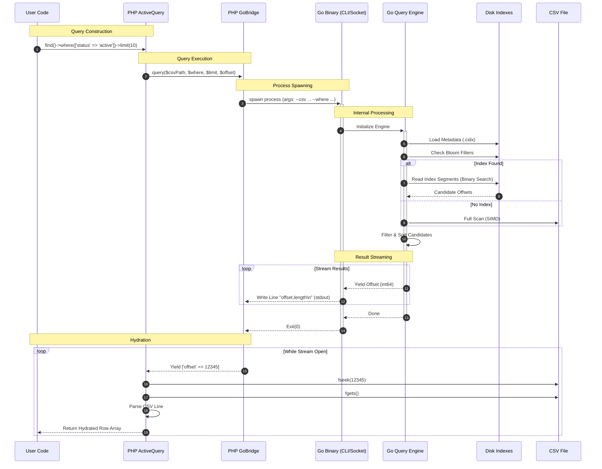

# Query Execution Flow

## Overview
This document details the step-by-step flow of a query from the PHP client application, through the `CsvQuery` library, to the Go binary, and back.

## Sequence Diagram

## Detailed Steps

### 1. Query Construction (PHP)
The user builds a query using the fluent API. No I/O happens here. The state is stored in the `ActiveQuery` object.

### 2. Execution & Transmission (PHP -> Go)
When `all()`, `one()`, or `each()` is called, `GoBridge` constructs the command line arguments or JSON payload for the socket.
- **CLI Mode**: `proc_open` launches `csvquery query ...`
- **Socket Mode**: `fsockopen` connects to `/tmp/csvquery.sock`

### 3. Engine Initialization (Go)
The Go process parses flags. It identifies the target CSV and Index Directory.

### 4. Index Lookup (Go)
The `QueryEngine` checks for `.cidx` files matching the query columns.
- **Composite Indexes**: Checked first for exact matches.
- **Single Column Indexes**: Used for intersection (AND queries).
- **Bloom Filters**: Checked to quickly reject non-existent values.

### 5. Scanning (Go)
- **Index Scan**: Binary search on the sorted `.cidx` file to find the range of offsets.
- **Full Scan**: If no index exists, the SIMD scanner reads the raw CSV file.

### 6. Streaming Response (Go -> PHP)
To minimize memory usage and serialization overhead, Go **DOES NOT** return row data. It returns **OFFSETS**.
Format: `12345,67\n` (Offset, Length)

### 7. Hydration (PHP)
PHP reads the stream of offsets. For each offset:
1. `fseek($handle, $offset)`: Jumps directly to the row.
2. `fgets($handle)`: Reads the raw line.
3. `str_getcsv()`: Parses the line into an array.
4. **Overrides**: Checks if any in-memory updates apply to this row.
